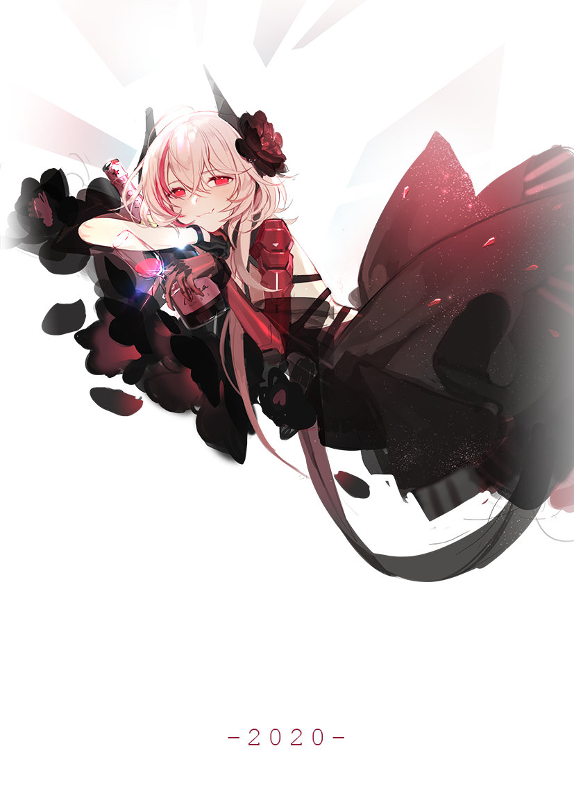
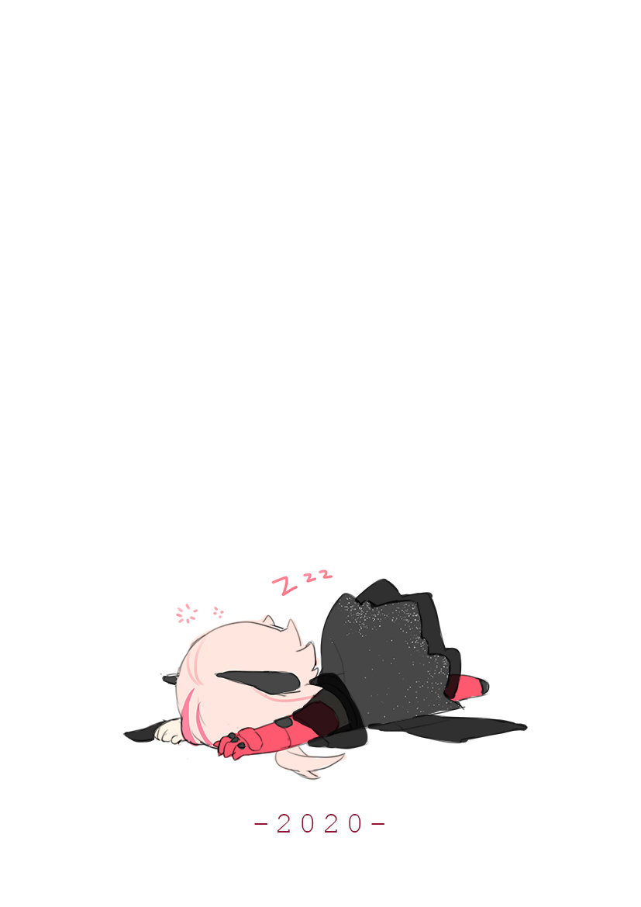

### You are the No.  visitor to this page!

####  Who am I

Welcome! Here is <b style="color: #42d2ca"> **kcn3388** </b>, Otaku desu(

Follow me if my repo help you somehow!

Newbee in coding.

[✨Blog✨](https://kcn3388.club)

[✨OLAINDEX✨](https://olaindex.kcn3388.club)

[✨Cloudreve✨](https://cloudreve.kcn3388.club)

Hard core player of Fate/go and Girls' Frontline

Now liking Hokusai in Fate/go

  
Image Warning

  
  
  

Melusine in Fate/go

  
Image Warning

  
  
   

  

And SopII in Girls' Frontline

  
Image Warning

  
  
  
  
  

#### Development Gears

+ HardWares：
  + CPU: Intel i7 13700K
  + GPU: GALAX BOOMSTAR 3080 MAX OC
  + RAM：GALAX HOF Pro 4000MHz DDR4 16G * 4
  + MotherBoard：ROG STRIX Z690-A GAMING WIFI D4
  + Radiator：Phanteks GLACIER ONE 360MP
  + Power：Segotep GP950G PRO FULL MODULAR
  + HardDrive：
    + Western Digital SN750 WDS100T3X0C-00SJG0 1T
    + Western Digital SN750 WDS500g3X0C-00SJG0 500G
    + Zhitai TiPRO7000 2T
    + Seagate Exos X18 ST16000NM0D0J-2TW103 16T
    + Seagate IronWolf ST4000VN008-2DR166 4T
    + Seagate SkyHawk ST4000VX007-2DT166 4T
+ System：Windows 10
+ IDEs: 
  + Jetbrain IDEs
  + Visual Studio
  + QT Creator

#### Working Now
Artificial Intelligency and Deep Learning in GNSS, Web Front-End designer, AI algorithm designer.

<!--
**kcn3388/kcn3388** is a ✨ _special_ ✨ repository because its `README.md` (this file) appears on your GitHub profile.

Here are some ideas to get you started:

- 🔭 I’m currently working on ...
- 🌱 I’m currently learning ...
- 👯 I’m looking to collaborate on ...
- 🤔 I’m looking for help with ...
- 💬 Ask me about ...
- 📫 How to reach me: ...
- 😄 Pronouns: ...
- ⚡ Fun fact: ...
-->
